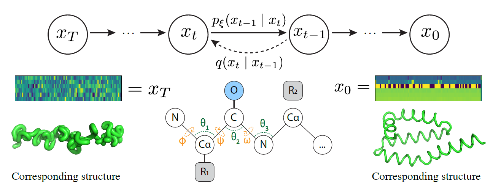

# foldingdiff-pytorch

[](https://github.com/Lightning-AI/lightning)



An unofficial re-implementation of FoldingDiff, a diffusion-based generative model for protein backbone structure generation.
The official implementation of FoldingDiff can be found [here](https://github.com/microsoft/foldingdiff).

## Gallery
### Noising 


### Denoising

<p float="left">
  
  
  
</p>

## Installation

Install through pip.
```bash
$ pip install foldingdiff-pytorch
```

## Quickstart

### Training
```bash
$ python -m foldingdiff_pytorch.train --meta data/meta.csv \
  --data-dir data/npy --batch-size 64
```

### Sampling
```bash
$ python -m foldingdiff_pytorch.sample --ckpt [CHECKPOINT_PATH] \
  --timepoints 1000 --out [OUTPUT_PATH]
```

### Sampling pipeline

With the `snakemake` command below, you can simply run unconditional protein backbone generation pipeline to obtain `.pt` files containing backbone coordinates and `.gif` files showing the whole denoising process.

```bash
$ snakemake -s sample.smk -j1
```

## Downloading and preprocessing training data
Download non-redundant protein backbone structure data (40% similary cutoff) from CATH.
```bash 
$ wget ftp://orengoftp.biochem.ucl.ac.uk/cath/releases/latest-release/non-redundant-data-sets/cath-dataset-nonredundant-S40.pdb.tgz
```

Extract the downloaded file and attach `.pdb` extension to files
```bash
$ tar xvf cath-dataset-nonredundant-S40.pdb.tgz && cd dompdb
$ for f in *; do mv "$f" "$f.pdb"; done
```

Run `snakemake` pipeline to convert pdb files to `npy` files containing angle information of shape (n, 6).
```
$ snakemake -s preprocess.smk -prq -j [CORES] --keep-going
```

## Reproduction status

Model training for reproduction is currently running. The live training log is available at [here](https://api.wandb.ai/links/dohlee/1drc1ujg).


### Ramachandran plot
Visualized Ramachandran plot for 10 samples of length 64 for sanity check while training.
Looks like the model is learning to produce reasonable secondary structures.

<p float="left">
  
  
</p>

## Citation
```bibtex
@misc{wu2022protein,
      title={Protein structure generation via folding diffusion}, 
      author={Kevin E. Wu and Kevin K. Yang and Rianne van den Berg and James Y. Zou and Alex X. Lu and Ava P. Amini},
      year={2022},
      eprint={2209.15611},
      archivePrefix={arXiv},
      primaryClass={q-bio.BM}
}
```